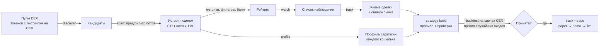

# Wallet Strategy Analyzer (`wsa/` в bbbot)

Система находит на DEX кошельки с устойчиво прибыльной торговлей, восстанавливает
их стратегию (какие активы и в какой момент они покупают, как набирают и
закрывают позицию), сводит несколько таких кошельков в одну проверенную
стратегию и исполняет её на CEX через API-ключи — по сигналам кошельков и
сканером рынка.

Главный вопрос, на который отвечает система: **какие характеристики актива
и момента эти трейдеры систематически ищут перед покупкой — и работает ли это
на бирже, где торгуете вы.**



## Быстрый старт

Пакет лежит в репозитории bbbot и работает из его корня, в том же `.venv`:

```bash
cd ~/bbbot
.venv/bin/python -m pip install -r wsa/requirements.txt   # ccxt; Python ≥ 3.12
./wsa.sh init        # wsa.toml и .env из примеров (wsa/config.example.toml, wsa/env.example), база data/wsa/wsa.db
./wsa.sh doctor      # доступ к источникам и какие ключи есть

# 1. токены, которые торгуются и на DEX (Solana), и на вашей CEX
./wsa.sh universe
# 2. кандидаты из пулов этих токенов (или из конкретной пары)
./wsa.sh discover --universe --minutes 0 --min-usd 500
./wsa.sh discover https://dexscreener.com/solana/<пара> --minutes 20
# 3. быстрый отсев, затем глубокий скан лучших
./wsa.sh scan --limit 100
./wsa.sh top
./wsa.sh scan <адрес> --depth deep
# 4. профиль стратегии кошелька (карточка из ТЗ)
./wsa.sh profile <адрес>
# 5. в наблюдение — лучших по баллу (или вручную: watch add <адрес>)
./wsa.sh watch auto --top 10 --min-score 55
# 6. слежение: копит живые сделки лидеров и снимки рынка (держатели, ликвидность)
./wsa.sh track
# 7. через период наблюдения — сводная стратегия, бэктест, отчёт
./wsa.sh strategy build
./wsa.sh backtest
./wsa.sh report --open
# 8. снимок для сайта: страница https://crypt.burbey.ru/wallets
./wsa.sh site        # -> webapp/data/wallets.json; на сайт попадает с коммитом этого файла
# 9. торговля: сначала бумага, потом демо-счёт, потом деньги
./wsa.sh track --trade paper
./wsa.sh trade status
```

Адреса из вкладки **Top Traders** на DexScreener (сайт закрыт проверкой
Cloudflare, поэтому автоматически их не снять) — сохраните в файл по одному
в строке и добавьте: `./wsa.sh import traders.txt --label dexscreener`.

## Сайт

Вкладка «Кошельки» на сайте bbbot (`/wallets`, на бою — https://crypt.burbey.ru/wallets)
показывает снимок `webapp/data/wallets.json`: воронку отбора, рейтинг, профили, стратегию,
бэктест, сигналы и отсеянных ботов. Сам анализатор на сервере не запускается — он долго
сканирует RPC и держит свою базу; снимок собирает `./wsa.sh site` (автопилот `research`
делает это после каждого цикла), на сайт он выезжает с коммитом, как остальные
`webapp/data/*.json`. Сервер пересобирает сайт сам примерно через минуту после пуша
в ветку `fix/audit-2026-08`.

## Источники данных

| Источник | Что даёт | Без ключа | С ключом |
|---|---|---|---|
| GeckoTerminal | сделки пула **с адресами кошельков** (поиск кандидатов), держатели и доля топ-10, свечи DEX ≤180 дней | ~10 запросов/мин | — |
| DexScreener | цена, ликвидность, MC, FDV, возраст пула | 300/мин | — |
| Solana RPC | история кошелька (подписи, разобранные транзакции v0 и v1) | mainnet-beta + publicnode, ~2–5 транзакций/с | `HELIUS_API_KEY`: 10/с и пакеты |
| Blockscout / Etherscan | история EVM-кошелька (Ethereum, Base, Arbitrum, Optimism, Polygon, BSC) | ~10 запросов в **час** — только проба | `BLOCKSCOUT_API_KEY` (бесплатно, 5/с) или `ETHERSCAN_API_KEY` |
| CEX через ccxt | рынки, тикеры, свечи за годы (1м–1д), дата листинга, торговля | публичные данные без ключа | ключ биржи — только для торговли |
| CoinGecko | сектор (Meme, AI, DeFi, RWA…) | ~10/мин | `COINGECKO_API_KEY` Demo: 100/мин |
| Birdeye (опц.) | топ трейдеров токена по реализованному PnL за 30/90 дней, лидеры сети | — | `BIRDEYE_API_KEY` (бесплатный Standard) |

Все ответы кэшируются в SQLite: свечи скачиваются один раз, метаданные токенов
живут от 15 минут до месяца.

## Как отбираются кошельки

**Разбор сделок.** Транзакция разбирается по изменению балансов кошелька,
а не по инструкциям, поэтому одинаково читаются Jupiter, Raydium, Orca,
Meteora, Pump.fun и торговые терминалы. SOL и wSOL — один актив; комиссия
сети и рента за токен-счета из цены убираются. Ранг «стейблкоин < SOL < токен»
определяет, что куплено и за что: своп SOL→USDC — продажа SOL, SOL→BONK —
покупка BONK. Цена каждой сделки в USD — на момент сделки: по котировке
(стейбл/SOL по 5-минутным свечам CEX) или по свечам токена.

**Позиции (FIFO).** Покупки и продажи собираются в циклы вход→выход.
Несколько покупок — набор позиции (DCA вниз / пирамида), несколько продаж —
частичный выход. Продажа токенов, которых кошелёк не покупал (эйрдроп, раздача
команде, перевод с другого кошелька), **не засчитывается как прибыль**.

**Метрики** (уровень 1 из ТЗ): реализованный и нереализованный PnL, ROI на
капитал и на сделки, win rate с нижней границей Уилсона (3 из 3 — это не 100%),
profit factor, средние прибыль и убыток, просадка (на капитале кошелька и
нормированная — 10% на сделку, для сравнения кошельков), удержание P25/P50/P75/P90,
частота, размер позиции, окна 30/90/180/365 дней и доля прибыльных месяцев,
концентрация (доля прибыли с одной монеты), доля оборота в токенах с листингом
на вашей CEX.

**Фильтры.** Жёсткие — кошелёк исключается: бот по частоте (отсекается ещё
до загрузки транзакций, по одной странице подписей), HFT (медианное удержание
< 5 минут), MEV (циклы за ≤10 секунд). Мягкие — штраф к баллу: мало сделок,
одна удачная монета, продажи без покупок, короткая история, свой контракт
вместо известных DEX, мало оборота в токенах с CEX.

**Балл 0–100**: прибыль, качество (PF, win rate, t-статистика), риск,
устойчивость по окнам, размер выборки, разнообразие, пригодность для CEX.
Веса — в `[scoring]`.

## Профиль стратегии кошелька

`./wsa.sh profile <адрес>` строит карточку по формату ТЗ: Performance,
Trading Style, Asset Selection, Entry Behavior, Position Building, Exit
Behavior, After Entry и текст **Detected Strategy**.

Для каждой покупки сохраняются условия входа — только по данным, доступным
до сделки:
- изменение цены за 1ч/4ч/24ч/7д/30д, объём 24ч к среднему за неделю;
- пробой 7-дневного максимума, отставание от максимумов, положение в диапазоне;
- волатильность, RSI, цена к средним;
- режим BTC и SOL;
- возраст токена, MC и FDV на входе, ликвидность, сектор;
- торговался ли уже на CEX и сколько дней с листинга (покупки до листинга видны отдельно);
- размер позиции к обычному для кошелька, номер покупки в цикле, повторный вход.

По этим признакам вход классифицируется как ранний, пробой, моментум или
покупка падения. Для каждого входа считается, что было с ценой дальше: через
1ч…30д, MFE/MAE за неделю, максимум за месяц.

## Сводная стратегия и её проверка

`./wsa.sh strategy build` берёт кошельки из списка наблюдения и:

1. собирает их входы; одновременные входы разных кошельков в один токен
   схлопываются в одну возможность;
2. объединяет адреса, которые почти всегда входят вместе (≥50% синхронных
   входов), — скорее всего это один владелец, в консенсусе он один голос;
3. строит **контрольную группу** — случайные моменты в тех же токенах за тот же
   период. «Подпись отбора» показывает, чем моменты входа группы отличаются от
   случайных: это прямой ответ на вопрос «что трейдер ищет перед покупкой»;
4. ищет правила из 1–2 условий на первых 70% истории и проверяет их на
   последних 30%. Критерии приёмки (`[strategy.acceptance]`) заданы **до
   прогона**: минимум сделок на проверке, средняя доходность после комиссий
   > 0, доля прибыльных ≥ 50%, деградация к обучению ≤ 75%;
5. отдельно ищет правила для **сканера рынка** — они проверяются на контрольной
   группе, то есть работают ли условия сами по себе, без выбора лидера;
6. калибрует выходы: стоп ниже типичной просадки выигрышных входов (MAE),
   тейки по квантилям MFE, тайм-стоп по горизонту удержания группы.

`./wsa.sh backtest` прогоняет стратегию на свечах вашей CEX. Движок честный:
- вход по открытию свечи после сигнала и задержки;
- комиссия и проскальзывание;
- внутри одной свечи стоп проверяется раньше тейка;
- гэп вниз исполняется по открытию свечи, а не по цене стопа.

Итог сравнивается с 200 прогонами тех же правил выхода на **случайных**
моментах входа в те же токены. Стратегия, которая не лучше случайности,
преимущества не имеет, как бы красиво ни выглядел её итог.

Если ни одно правило не прошло проверку, стратегия помечается «не принята»,
а трекер только наблюдает и копит данные.

## Торговля на CEX

Режимы: `paper` (по живому стакану биржи, без денег и ключей) → `demo`
(демо-счёт Bybit) → `testnet` → `live` (только с подтверждением в консоли).

- **Ключи** — только в окружении или `.env`: `BYBIT_API_KEY` / `BYBIT_API_SECRET`,
  те же имена, что в bbbot. Для других бирж — `<EXCHANGE>_API_KEY` / `_API_SECRET` /
  `_API_PASSWORD`.
- **Права ключа** — только торговля, без вывода. `./wsa.sh trade check --mode demo`
  покажет баланс и права ключа и предупредит, если вывод разрешён.
- **Отдельный субаккаунт Bybit** под эту стратегию: боты bbbot и анализатор не должны
  делить маржу и позиции одного счёта (ключи у них называются одинаково — для
  субаккаунта задайте их в отдельном `.env` или окружении процесса `wsa`).
- **Проверки перед входом:**
  - балл лидера и консенсус независимых лидеров;
  - листинг токена на CEX и оборот;
  - совпадение с принятым правилом;
  - спред;
  - «не догоняем» — цена CEX не ушла выше цены лидера больше чем на `max_chase`.
- **Размер позиции:** риск на сделку / расстояние до стопа, с потолком доли
  капитала и общей экспозиции.
- **Выходы:**
  - биржевой страховочный стоп;
  - лесенка тейков, после первого тейка — безубыток и трейлинг;
  - тайм-стоп;
  - выход вслед за продажей лидера.
- **Стоп-краны:** дневной лимит убытка, остановка при просадке от пика (снимается
  только `./wsa.sh trade reset`), пауза после серии убытков, пауза по тикеру.

## Ограничения — честно

- Бесплатные источники медленные: без ключа Helius глубокий скан кошелька занимает
  минуты. Боты отсекаются быстро, по списку подписей.
- Пул SOL/USDC и другие ликвидные пулы почти полностью заняты ботами (замер
  сентября 2026: все кандидаты из пула SOL/USDC на Orca и все кошельки,
  встреченные в 3+ пулах вселенной, — арбитраж с 20 тыс.–1.3 млн транзакций
  в сутки). Людей ищите в пулах средних токенов, через Birdeye и Top Traders
  DexScreener.
- MC на входе оценивается как текущая капитализация × (цена входа / текущая цена):
  точно для токенов с фиксированным предложением и приблизительно для токенов
  с разлоками. Ликвидность и держатели на момент входа точны только для сделок,
  которые видел трекер (он делает снимки). Поэтому период наблюдения улучшает данные.
- Кошелёк может выйти через перевод на CEX — такой выход учитывается без прибыли,
  результат неизвестен.
- Прошлые результаты кошельков и бэктеста не гарантируют будущих. Это инструмент
  анализа, а не финансовая рекомендация.

## Команды

| Команда | Что делает |
|---|---|
| `init`, `doctor` | подготовка и проверка источников/ключей |
| `universe` | токены сети, которые торгуются и на DEX, и на CEX (сверка цены) |
| `discover <ссылка\|пул\|токен>` / `--universe` / `--birdeye TOKEN` / `--gainers` | поиск кандидатов |
| `import <файл\|адреса>` | ручной импорт (например, из Top Traders) |
| `scan [адреса] [--depth deep]` | история, метрики, балл |
| `top` | рейтинг |
| `profile <адрес> [--refresh]` | карточка стратегии кошелька |
| `watch add\|rm\|list\|auto` | список наблюдения |
| `track [--trade paper\|demo\|testnet\|live]` | живое слежение и торговля |
| `strategy build\|show` | сводная стратегия группы |
| `backtest [--tf 15m\|1h] [--all]` | бэктест против случайных входов |
| `trade status\|reset\|close [тикер]\|check` | управление торговлей |
| `report [--open]` | подробный HTML-отчёт `data/wsa/report.html` |
| `site` | снимок для страницы сайта `/wallets` (`webapp/data/wallets.json`) |
| `research --loop` | автопилот: кандидаты → скан → профили → наблюдение → стратегия → снимок |

## Структура

Файлы пользователя в корне bbbot (все необязательны): `wsa.toml` — настройки поверх
`wsa/config.py`, `.env` — ключи, `wsa_labels.csv` — метки адресов бирж. Данные — `data/wsa/`
(в .gitignore): база, кэш свечей, стратегия, отчёт.

```
wsa/sources/    клиенты API: dexscreener, geckoterminal, solana_rpc, evm, cex (ccxt), coingecko, birdeye
wsa/chains/     разбор транзакций Solana и EVM в ноги сделок
wsa/core/       цены, FIFO-циклы, метрики, фильтры и балл, признаки входа, профиль,
                стратегия (правила, контроль, приёмка), бэктест
wsa/pipeline/   discover, scan, enrich, track
wsa/trading/    сигналы, риск-менеджмент, брокеры (paper/ccxt), движок
wsa/report/     HTML-отчёт
wsa/tests/      44 проверки без сети: разбор, позиции, метрики, отсутствие заглядывания
                в будущее, поиск правил, честность бэктеста, риск, цикл сделки
```

Тесты: `.venv/bin/python -m unittest discover -s wsa/tests`
